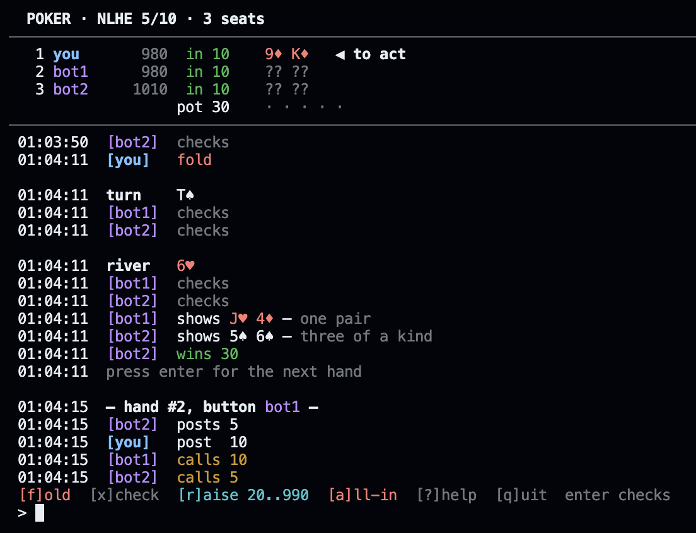

# poker

A no-limit hold'em engine in C++20, with a terminal client and Python bindings.

The engine is a pure state machine. You hand it stacks, a button seat and a
shuffled deck, then drive the hand with `legal_actions` / `apply` until it is
over. It does no I/O, draws no randomness, and a `State` is a flat struct you
can copy freely. Up to six seats, with the awkward parts done properly:
min-raise rules, undersized all-ins, side pots, split pots.

## Playing

```sh
just play                          # you against five bots
poker play --bots 2 --stakes 25/50 --seed 42
```

At the table: `fold` (f), `check` (x), `call` (c), `raise 60` (r, bet, b),
`allin` (a), `help`, `quit`. Raises are always to a total, so `raise 60` means
"make my bet 60". A bare enter checks or calls.



When output is piped the game falls back to a plain transcript, which is also
what the test suite drives. Two more subcommands: `poker eval "AhKd 7c8c9h"`
ranks a hand, `poker sim --hands 100000` plays bot-vs-bot as a soak test.

## Using the engine

```cpp
#include <poker/core/engine.hpp>
#include <poker/core/shuffle.hpp>

using namespace poker::core;

const auto deck = shuffled_deck(seed);
State s = new_hand({.small_blind = 5, .big_blind = 10}, stacks, button, deck);
while (!is_terminal(s)) {
  const LegalActions la = legal_actions(s);
  apply(s, decide(la)); // your policy
}
const auto winnings = payouts(s);
```

The same loop from Python. `pip install .` builds the module against your
Python, no vcpkg needed. For hacking on the repo, `just py` builds and tests
it in-tree and `just example` runs `bindings/python/example.py`:

```python
import pokercore as pc

s = pc.new_hand(pc.TableConfig(5, 10), [1000, 1000], 0, pc.shuffled_deck(7))
while not pc.is_terminal(s):
    la = pc.legal_actions(s)
    pc.apply(s, pc.Action(pc.Kind.CALL if la.can_call else pc.Kind.CHECK))
print(pc.payouts(s))
```

## Design

The rules live in [docs/rules.md](docs/rules.md), not in the code. Card
encodings, the hand ranking layout, blind order, the min-raise rule, side pot
construction, who gets the odd chip in a split: each is a sentence in that
file first and an implementation second. When code and document disagree, the
code is wrong. That is also where the edge cases are pinned down, like the
wheel counting as a five-high straight and an all-in below the minimum raise
not reopening the betting.

Some choices that shape the code:

- A card is one byte, `rank * 4 + suit`, so rank is a shift and suit is a
  mask. A whole deck fits in a `uint64` bitmask.
- A hand's strength is one `uint32`: category in the top bits, then up to
  five 4-bit kickers in falling significance. Comparing two hands is integer
  `>`, ties are exact equality, and both evaluators can build the identical
  bit pattern, which is what makes them comparable bit for bit.
- Shuffling is Fisher-Yates over SplitMix64 with Lemire's bounded draw,
  fully specified in rules.md. `std::shuffle` is banned because its output
  differs between standard libraries; here the same seed deals the same hand
  on every platform.

## Building

Needs CMake 3.25+, Ninja, a C++20 compiler and
[vcpkg](https://github.com/microsoft/vcpkg) with `VCPKG_ROOT` set. The engine
itself has no dependencies; tests, benchmarks and bindings pull theirs
through vcpkg features.

```sh
just test          # build and run everything under ASan/UBSan
just bench         # hand evaluator benchmark, release mode
just play          # build the CLI and sit down
just py            # build the Python module and run its tests
just fmt
```

Without just: `cmake --preset asan && cmake --build --preset asan && ctest --preset asan`.
Presets: `debug`, `release`, `asan`, `release-py`.

## Correctness and speed

There are two hand evaluators behind one signature. The fast one builds
per-suit rank masks and a rank histogram in a single pass, finds flushes with
`popcount` and straights with a sliding 5-bit window. The slow one sorts and
classifies all 21 five-card subsets and exists only to be obviously correct.
Measured on one Apple M-series core, release build:

| What | Rate |
| --- | --- |
| rank a 7-card hand (`evaluate_fast`) | 29ns, ~34M hands/s |
| the reference evaluator | 630ns, ~1.6M hands/s |
| full hands, 6 seats (`poker sim`) | ~0.9M hands/s |
| full hands, heads-up | ~1.8M hands/s |

A full hand means shuffle, blinds, betting, side pots and showdown; the
numbers come from `just bench` and `poker sim --hands 1000000`.

Speed claims are cheap; the test suite is the real story. Every one of the
2,598,960 possible 5-card hands is ranked by both evaluators and compared bit
for bit, and the category totals must match the known odds (40 straight
flushes, 624 quads, and so on), an oracle independent of both
implementations. Another 200,000 random 7-card hands are fuzzed on top, and
the betting engine plays thousands of random hands driven only through
`legal_actions`, asserting after every action that chips are conserved and at
the end that payouts return exactly the pot. That comes to about 330,000
checked assertions per run, all under ASan and UBSan in CI on Linux and
macOS. The fuzzer earned its keep early by finding a real side pot bug: a
folded blind could strand chips when everyone else was all-in for less.

Apache-2.0.
